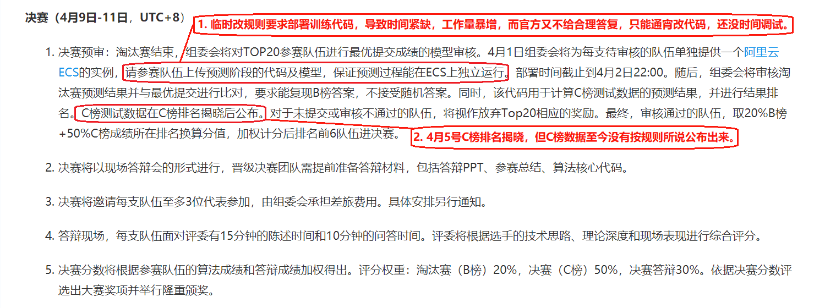
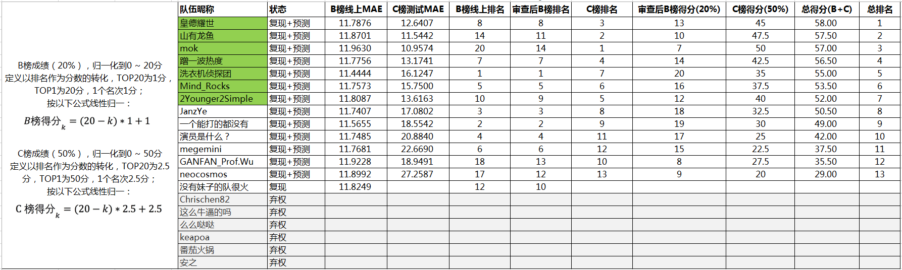

## Train

bash train.sh B  # for test B, models will be saved in ../train/models/

bash train.sh C  # for test C, but it is no need to train it again

## Predict

bash test.sh B  # for test B

bash test.sh C  # for test C

## References
Lv, Y., Duan, Y., Kang, W., Li, Z., & Wang, F. Y. (2015). 
Traffic Flow Prediction with Big Data: A Deep Learning Approach. 
IEEE Transactions on Intelligent Transportation Systems, 16(2), 
865–873. https://doi.org/10.1109/TITS.2014.2345663

Liu, L., & Chen, R. (2017). 
A novel passenger flow prediction model using deep learning methods. 
Transportation Research Part C, 84, 
74–91. https://doi.org/10.1016/j.trc.2017.08.001

## Feature
block: range(0, 60 / 10 * 24)

stationID: range(0, 81)

status: range(0, 2)

payType: range(0, 4)

week: range(0, 7)

holiday: range(0, 2)

flow: number_in or number_out

yesterday: the flow of yesterday, has many differences to daily meanings

lastWeek: just the flow of (current day - 7)

averWeek: the mean of days before current day with the same week feature value

averWeekOutIn: similar to averWeek, but ignore pay type

yesterdayNormal: in daily meanings

Can see the rules of generating historical features in generateHistoricData

## Models

In the first time, I try to use SAE showed in the References, but it is 
hard to train and spend much more time in training, and the time of 
this competition is short, so I finally choose fully connected 
networks, which I thought can have similarity performance to SAE.

The construction of features in the References is not suitable to this 
competition, due to the data sets has very large difference. 
The training data set of this competitions has very strong relation 
between weeks, but the test data don't have such a good pattern, so it 
will lead to over-fitting. 

Problems: there are many mistakes made by myself, many models' 
parameters are wrongly set, such as not set drop out, wrong n_outputs, 
wrong features to train, and wrong validate set. But due to the need of 
recurring the result of test B, these wrong settings are being kept.

All the models used in test B are base on the fully connected network 
with different parameters. The differences of each model will be list 
below:

#### model_1228
training data: 2019-01-03 -> 2019-10-23

validate data: 2019-01-24 -> 2019-10-25

weights = [1, 0, 0]  # the weight of three different loss functions

lr = 0.0001  # learning rate

constants.FEAT_LEN = [144, 81, 2, 4, 7, 1]  # the length of each feature being one-hot encoding

constants.HEADER_FEAT = ['block', 'stationID', 'status', 'payType', 'weekDay', 'flow'] # the features used in this model

constants.HEADER_HIS = ['yesterday']  # the features generate by historical data

n_inputs = sum(constants.FEAT_LEN)  # the real input of nn is n_inputs * n_outputs 

n_outputs = 3  # the output of nn

n_mlp = [400, 400, 400]  # the size of each hidden layer

##### model_1228_tol
training data: 2019-01-03 -> 2019-10-25

validate data: not important, training stopped according to the training epoch of model_1228

weights = [1, 0, 0]

lr = 0.0001

constants.FEAT_LEN = [144, 81, 2, 4, 7, 1]

constants.HEADER_FEAT = ['block', 'stationID', 'status', 'payType', 'weekDay', 'flow']

constants.HEADER_HIS = ['yesterday']

n_inputs = sum(constants.FEAT_LEN)

n_outputs = 4

n_mlp = [400, 400, 400]

##### model_1250
training data: 2019-01-03 -> 2019-10-23

validate data: 2019-01-24 -> 2019-10-25

weights = [10000, 100, 1]

lr = 0.0001

constants.FEAT_LEN = [144, 81, 2, 4, 7, 1]

constants.HEADER_FEAT = ['block', 'stationID', 'status', 'payType', 'weekDay', 'flow']

constants.HEADER_HIS = ['yesterday']

n_inputs = sum(constants.FEAT_LEN)

n_outputs = 3

n_mlp = [400, 400, 400]

##### model_1250_tol
training data: 2019-01-03 -> 2019-10-25

validate data: not important, training stopped according to the training epoch of model_1250

weights = [10000, 100, 1]

lr = 0.0001

constants.FEAT_LEN = [144, 81, 2, 4, 7, 1]

constants.HEADER_FEAT = ['block', 'stationID', 'status', 'payType', 'weekDay', 'flow']

constants.HEADER_HIS = ['yesterday']

n_inputs = sum(constants.FEAT_LEN)

n_outputs = 4

n_mlp = [400, 400, 400]

##### model_1266
training data: 2019-01-03 -> 2019-10-23

validate data: 2019-01-24 -> 2019-10-25

weights = [1, 0, 0]

lr = 0.0001

constants.FEAT_LEN = [144, 81, 2, 4, 7, 1]

constants.HEADER_FEAT = ['block', 'stationID', 'status', 'payType', 'weekDay', 'flow']

constants.HEADER_HIS = ['yesterday']

n_inputs = sum(constants.FEAT_LEN)

n_outputs = 4

n_mlp = [500, 500]

##### model_1266_tol
training data: 2019-01-03 -> 2019-10-25

validate data: not important, training stopped according to the training epoch of model_1266

weights = [1, 0, 0]

lr = 0.0001

constants.FEAT_LEN = [144, 81, 2, 4, 7, 1]

constants.HEADER_FEAT = ['block', 'stationID', 'status', 'payType', 'weekDay', 'flow']

constants.HEADER_HIS = ['yesterday']

n_inputs = sum(constants.FEAT_LEN)

n_outputs = 4

n_mlp = [500, 500]

##### model_1294
training data: 2019-01-01 -> 2019-10-24

validate data: 2019-10-25

weights = [1, 0, 0]

lr = 0.001
constants.FEAT_LEN = [144, 81, 2, 4, 7, 2, 1, 1, 1]

constants.HEADER_FEAT = ['block', 'stationID', 'status', 'payType', 'weekDay',  'holiday', 'flow']

constants.HEADER_HIS = ['yesterdayNormal', 'lastWeek', 'averWeek']

n_inputs = sum(constants.FEAT_LEN)

n_outputs = 4

n_mlp = [400, 400, 400, 400, 400, 400]

##### model_1294_tol
training data: 2019-01-03 -> 2019-10-25

validate data: not important, training stopped according to the training epoch of model_1294

weights = [1, 0, 0]

lr = 0.001

constants.FEAT_LEN = [144, 81, 2, 4, 7, 2, 1, 1, 1]

constants.HEADER_FEAT = ['block', 'stationID', 'status', 'payType', 'weekDay',  'holiday', 'flow']

constants.HEADER_HIS = ['yesterdayNormal', 'lastWeek', 'averWeek']

n_inputs = sum(constants.FEAT_LEN)

n_outputs = 4

n_mlp = [400, 400, 400, 400, 400, 400]

##### model_1305
training data: 2019-01-01 -> 2019-10-22

validate data: 2019-01-23 -> 2019-10-25

weights = [1, 0, 0]

lr = 0.0001

constants.FEAT_LEN = [144, 81, 2, 4, 7, 2, 1, 1, 1]

constants.HEADER_FEAT = ['block', 'stationID', 'status', 'payType', 'weekDay',  'holiday', 'flow']

constants.HEADER_HIS = ['yesterdayNormal', 'lastWeek', 'averWeek']

n_inputs = sum(constants.FEAT_LEN)

n_outputs = 4

n_mlp = [400, 400, 400]

##### model_1305_tol
training data: 2019-01-03 -> 2019-10-25

validate data: not important, training stopped according to the training epoch of model_1305

weights = [1, 0, 0]

lr = 0.0001

constants.FEAT_LEN = [144, 81, 2, 4, 7, 2, 1, 1, 1]

constants.HEADER_FEAT = ['block', 'stationID', 'status', 'payType', 'weekDay',  'holiday', 'flow']

constants.HEADER_HIS = ['yesterdayNormal', 'lastWeek', 'averWeek']

n_inputs = sum(constants.FEAT_LEN)

n_outputs = 4

n_mlp = [400, 400, 400]

more detials: see the source code.

##### Blend
get the mean of results predicted by above models

## 比赛存在的问题

1. 临时改规则要求部署训练代码，导致时间紧缺，工作量暴增，
   而官方又不给合理答复，只能通宵改代码，还没时间调试。

2. 结果不透明，刚开始只有晋级的会收到邮件，其他人都不知道
   情况如何，问官方给不给C榜结果，回复说不给。
   后面把截图发群里，又改说在讨论（晋级的队伍都决定了，居然还在讨论C榜结果......）。
   后面过了一天，才给了一张B&C榜结果的图片（此处可自行想象）......

3. 4月5号C榜排名揭晓，但C榜数据至今没有按规则所说公布出来。
   无论在官方群询问还是私聊官方工作人员什么时候公布C榜数据，都不给答复。
   因此，至今不知为何大半队伍结果的目标是星辰大海，无法解决模型可能存在的问题。
   
总的来说，此次参加比赛，是本渣渣第一次真正意义参加比赛，
给自己带来了很多的锻炼，也认识了些大佬，但也遇到了解到了些自己不希望会存在的事情：
不按规则办事，结果不透明，工作人员基本不回答参赛人员关注的问题，最后只有下图一个结果
（一些聊天截图在考虑放不放出来......）。此次参加比赛只能说体验很差，对天池也感到很失望。

